# Diagramas de Secuencia

Este documento presenta los diagramas de secuencia de análisis y de diseño del sistema de gestión de videojuegos. Los diagramas de análisis describen responsabilidades del dominio sin comprometer clases concretas; los de diseño reflejan los controladores, servicios, repositorios, vistas y recursos identificados en la implementación.

## Criterio de modelado

- **Análisis:** actor, sistema, catálogo, videojuego e imagen como responsabilidades conceptuales.
- **Diseño:** navegador, controlador MVC, servicios, repositorio JPA, base de datos, vistas Thymeleaf y sistema de archivos.
- **Alcance:** catálogo público, búsqueda, detalle, alta, modificación y baja lógica de videojuegos.
- **Regla transversal:** las consultas públicas solo consideran videojuegos activos.

## 1. Consulta del catálogo público

### 1.1 Diagrama de análisis

<!-- mermaid-checked: every participant uses `participant Id as "Label"`, no \n in aliases/messages/notes, every alt/opt/loop closed by end, no `:` inside any alias -->
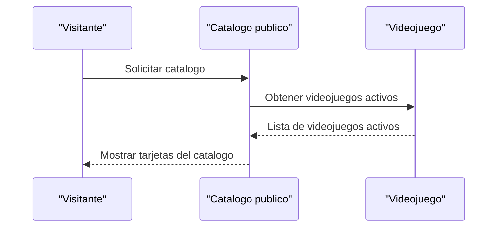

### 1.2 Diagrama de diseño

<!-- mermaid-checked: every participant uses `participant Id as "Label"`, no \n in aliases/messages/notes, every alt/opt/loop closed by end, no `:` inside any alias -->
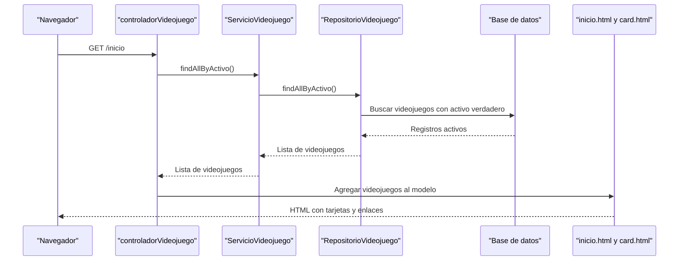

## 2. Consulta del detalle

### 2.1 Diagrama de análisis

<!-- mermaid-checked: every participant uses `participant Id as "Label"`, no \n in aliases/messages/notes, every alt/opt/loop closed by end, no `:` inside any alias -->
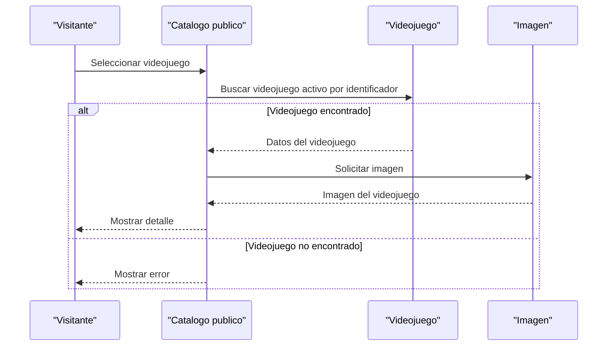

### 2.2 Diagrama de diseño

<!-- mermaid-checked: every participant uses `participant Id as "Label"`, no \n in aliases/messages/notes, every alt/opt/loop closed by end, no `:` inside any alias -->
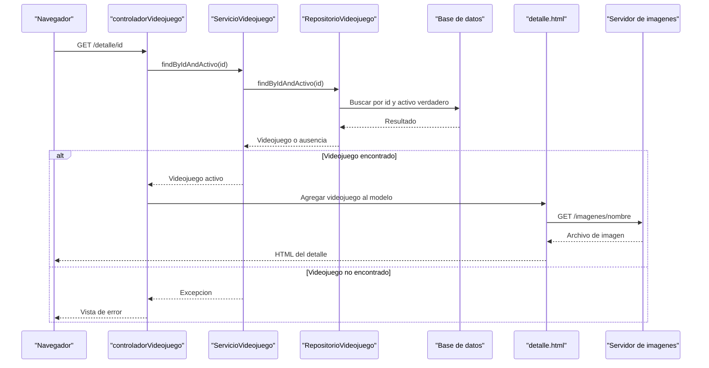

## 3. Busqueda por titulo

### 3.1 Diagrama de análisis

<!-- mermaid-checked: every participant uses `participant Id as "Label"`, no \n in aliases/messages/notes, every alt/opt/loop closed by end, no `:` inside any alias -->
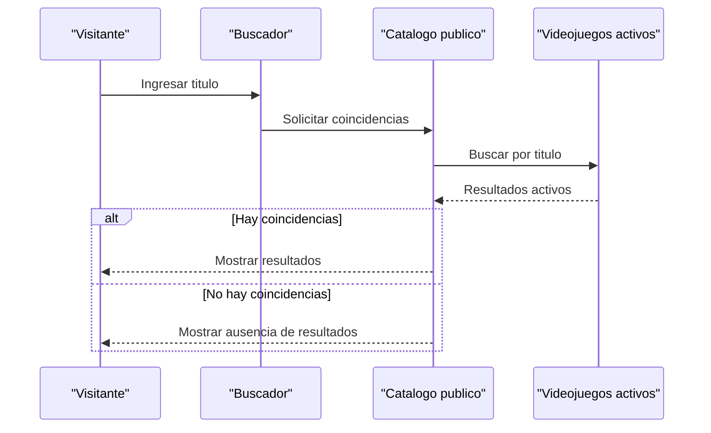

### 3.2 Diagrama de diseño

<!-- mermaid-checked: every participant uses `participant Id as "Label"`, no \n in aliases/messages/notes, every alt/opt/loop closed by end, no `:` inside any alias -->
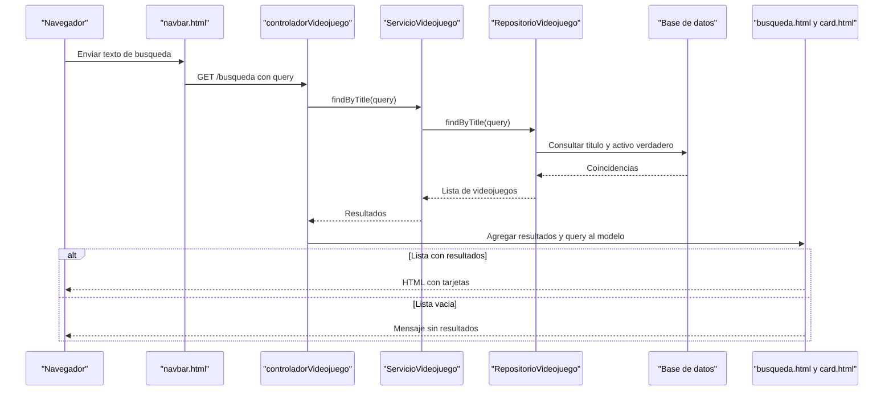

## 4. Alta de videojuego

### 4.1 Diagrama de análisis

<!-- mermaid-checked: every participant uses `participant Id as "Label"`, no \n in aliases/messages/notes, every alt/opt/loop closed by end, no `:` inside any alias -->
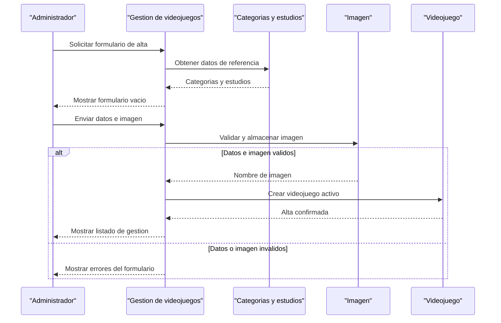

### 4.2 Diagrama de diseño

<!-- mermaid-checked: every participant uses `participant Id as "Label"`, no \n in aliases/messages/notes, every alt/opt/loop closed by end, no `:` inside any alias -->
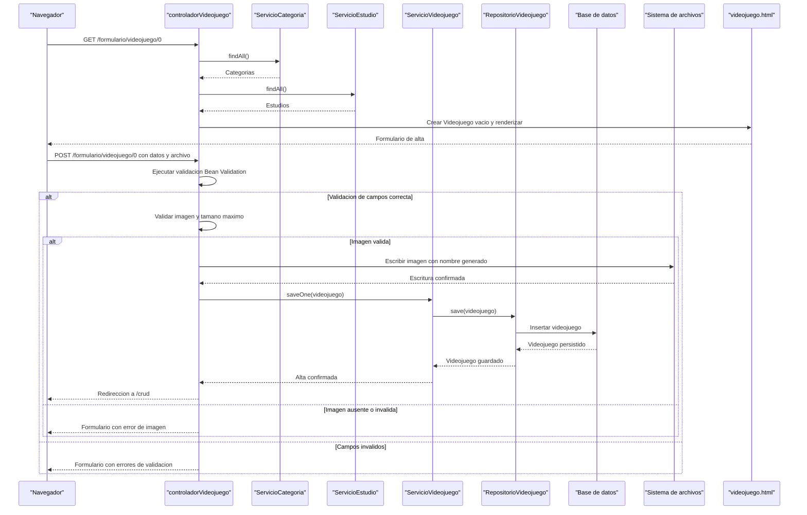

## 5. Modificacion de videojuego

### 5.1 Diagrama de análisis

<!-- mermaid-checked: every participant uses `participant Id as "Label"`, no \n in aliases/messages/notes, every alt/opt/loop closed by end, no `:` inside any alias -->
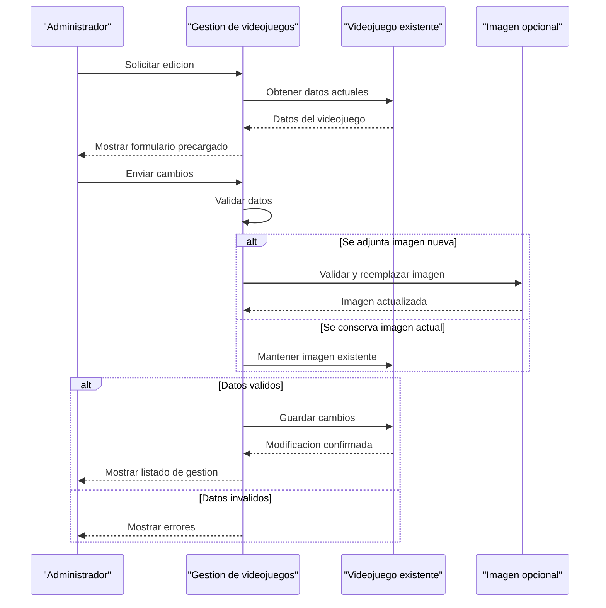

### 5.2 Diagrama de diseño

<!-- mermaid-checked: every participant uses `participant Id as "Label"`, no \n in aliases/messages/notes, every alt/opt/loop closed by end, no `:` inside any alias -->
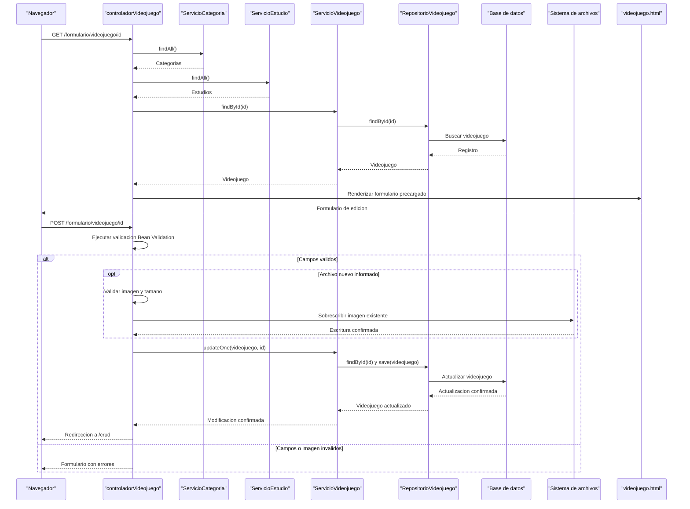

## 6. Baja logica de videojuego

### 6.1 Diagrama de análisis

<!-- mermaid-checked: every participant uses `participant Id as "Label"`, no \n in aliases/messages/notes, every alt/opt/loop closed by end, no `:` inside any alias -->
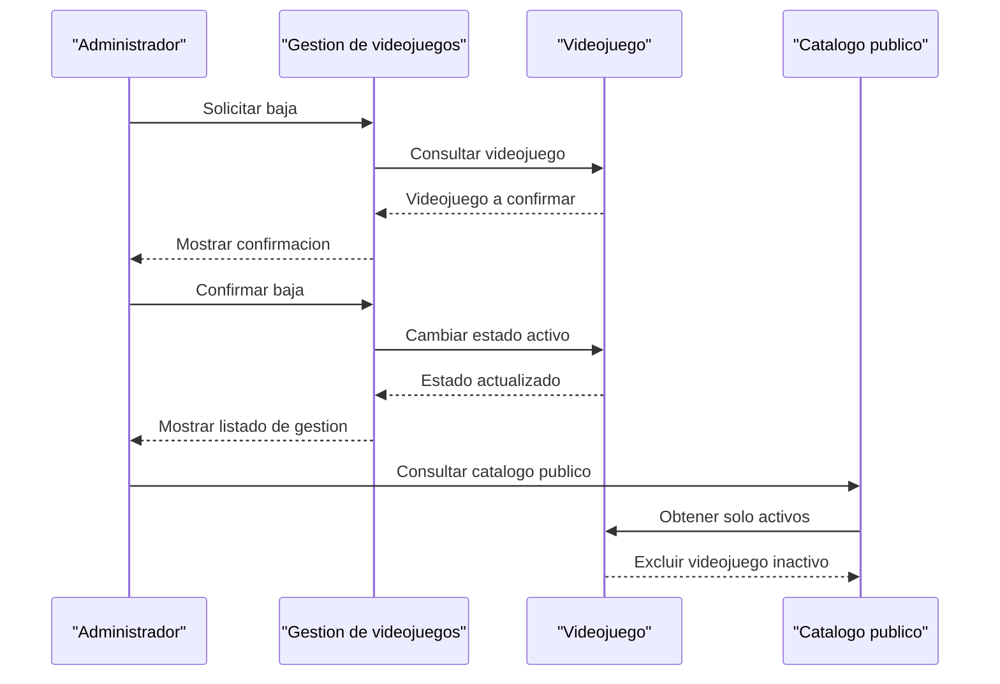

### 6.2 Diagrama de diseño

<!-- mermaid-checked: every participant uses `participant Id as "Label"`, no \n in aliases/messages/notes, every alt/opt/loop closed by end, no `:` inside any alias -->
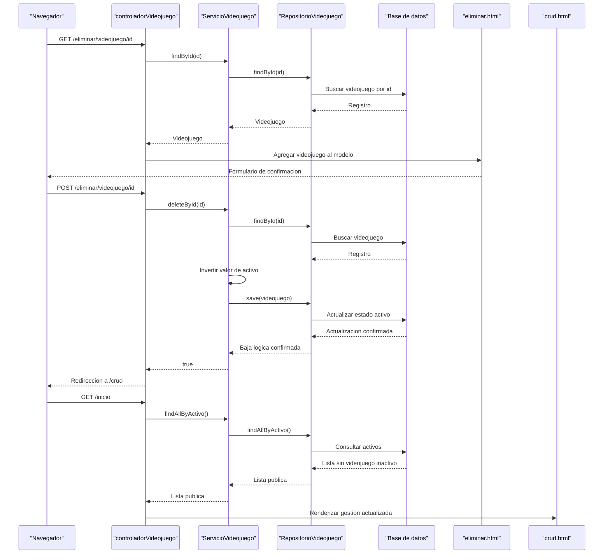

## Observaciones

- La baja implementada es lógica: `deleteById` invierte el atributo `activo`; no elimina físicamente el registro.
- Las imágenes se guardan en `C:/Videojuegos/imagenes`, fuera del classpath de la aplicación.
- Los errores de validación regresan al formulario; las excepciones del controlador se derivan a `error.html`.
- Las categorías y estudios son datos de referencia usados durante alta y modificación.
